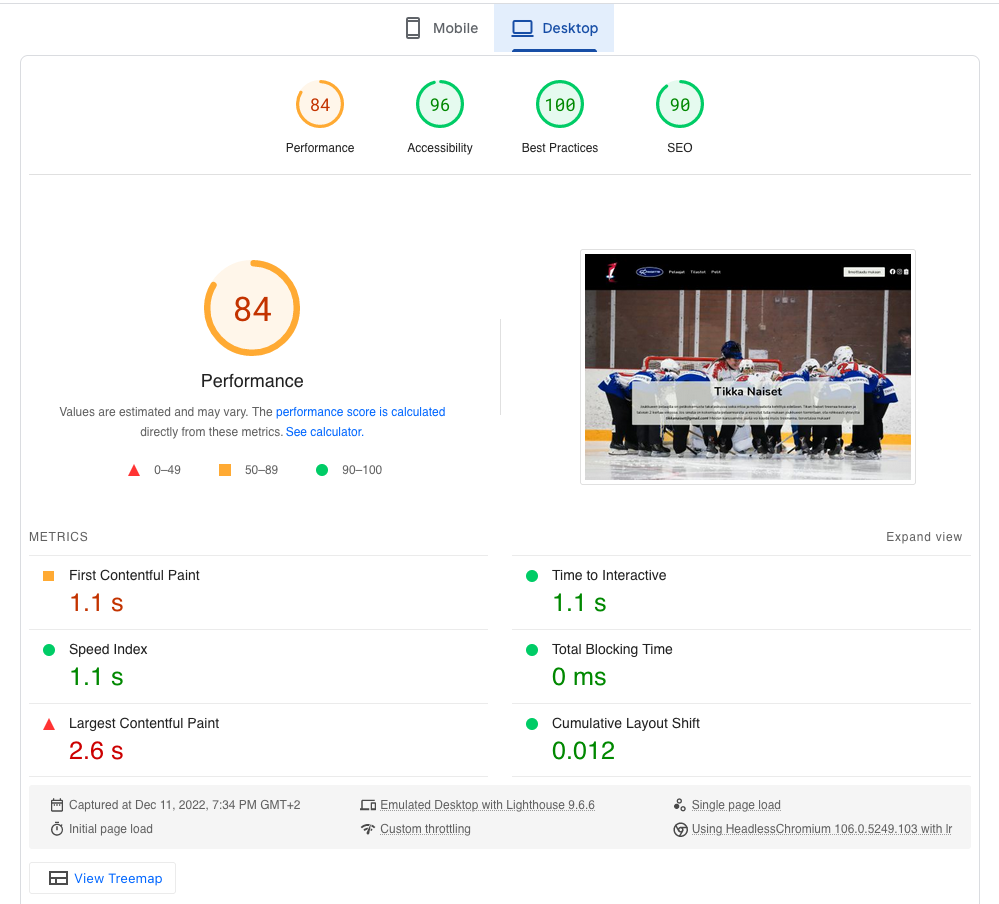

<!-- omit in toc -->
# Kurssin lopputyön raportti

**Opiskelija:** Nelli Laine

**Opiskelijanumero:** AB5057

**Linkki verkkosivuille:** [Verkkosivut](https://ab5057.pages.labranet.jamk.fi/web-visualizations/FinalAssignment/index.html)

**Sisällysluettelo**

- [Ajankäyttö](#ajankäyttö)
  - [Suunnittelu](#suunnittelu)
  - [CSS-kirjasto](#css-kirjasto)
  - [Sisällön tuottaminen](#sisällön-tuottaminen)
  - [Ulkoasun muokkaaminen](#ulkoasun-muokkaaminen)
  - [Sivun rakentaminen](#sivun-rakentaminen)
  - [Raportointi](#raportointi)
- [Teknologiavalinnat](#teknologiavalinnat)
  - [Nopeustestin tulokset](#nopeustestin-tulokset)
- [Ajatukset ja opit lopputyöstä](#ajatukset-ja-opit-lopputyöstä)
- [Arvosanaehdotus](#arvosanaehdotus)

## Ajankäyttö

> Kirjoita tänne miten aikaa on käytetty mihinkin eri osa-alueeseen lopputyössä.

Tähän taulukkoon on koottu projektin eri osa-alueiden ajankäyttö. Ajankäytöstä tarkemmin jokaisen osa-alueen kappaleessa

| Vaihe                 | Aikaa käytetty  |
| :-------------------- | :-------------: |
| Suunnittelu           |       2 h       |
| CSS-kirjasto          |       3 h       |
| Sisällön tuottaminen  |       4 h       |
| Ulkoasun muokkaaminen |       4 h       |
| Sivujen rakentaminen  |      26 h       |
| Raportointi           |   1 h 30 min    |
| **Yhteensä**:         | **40 h 30 min** |

### Suunnittelu

Päätin toteuttaa kurssin lopputyönä verkkosivut ringettejoukkueelleni Tikkakosken Tikan Naisten harrasteelle. Suunnittelin karkean prototyypin kurssin harjoituksessa 11, joka antaa suuntaa sille mitä verkkosivulle ajattelin toteuttaa. Muutin kuitenkin suunnitelmaa siten, että teen verkkosivut näin aluksi vain omalle joukkueelle, enkä koko seuralle. Lisäsin joukkueen sivuille pelaajakortit, tilastot, tulevat ottelut, sekä ilmoittautumislomakkeen. 

Sivun taustan väriksi asetin yläosan mustasta alaosan tumman siniseen liukuvan värin. Yläosaan tuli navigointi, josta löytyy joukkueen logo, linkit pelaajakortteihin sekä tilastoihin ja tuleviin pelehin. Lisäksi navigointipalkista löytyy etusivulla myös painike ilmoittautumislomakkeelle. Muilla sivuilla navigoinnin oikeassa laidassa on linkit joukkueen someen. Sivulle tulee sitten sisältöä sen mukaan millä sivulla ollaan:

* Pelaajakortteihin on tarkoitus tehdä animaatiota:
  * Kun korttia klikkaa, niin se kääntyy ympäri ja näyttää tilastot ym. tiedot pelaajasta.
  * Muutin tämän kuitenkin myöhemmin siten, että kortti kääntyy hoverilla. Näin vältyin hieman JS:n kirjoittamiselta.
* Tilastoihin olisi tarkoitus tehdä hakua, mutta sitä en ehdi toteuttaa (ehkä myöhemmin), joten teen sivulle vain taulukon, josta näkee koko joukkueen tilastot
  * Tein tässä vaiheessa tein kuitenkin vain sarakkeiden järjestämisen
* Yhteydenottolomakkeelle tulee perustiedot, kuten nimi ja email, sekä vapaa tekstikenttä

Jos jää aikaa, niin haluaisin toteuttaa sivulle myös some-kanavien sisällytyksen esim. iframella. Jätin tämän kuitenkin optioksi, sillä minulla oli rajallinen aika.

Suunnitteluun käytin aikaa suunnilleen 2 tuntia.

### CSS-kirjasto

Tein CSS-kirjaston asennuksen ja tiedostojen luonnin Bulman ohjeiden mukaisesti. Alkutilanteeseen pääsemiseen meni noin 30 minuuttia. Asensin Bulman tiedostot heidän verkkosivujen ohjeiden mukaisesti käyttäen node-sass asennusta VS Coden terminalissa. Ohjeiden mukana sain luotua sivun HTML-tiedoston sekä asetettua sinne esimerkkisisältöä, jonka perusteella pystyn aloittamaan omien sivujen muokkaamisen. 

Asentamisen jälkeen aloitin tutustumaan kirjastoon sekä sen luokkiin. Kirjastoon tutustuminen jatkoi koko ajan samalla kun ulkoasua muokattiin ja uusia elementtejä lisättiin. Yhteensä CSS-kirjaston kanssa meni aikaa noin 3 tuntia.

### Sisällön tuottaminen

Sisällön tuottamiseen minulla kului aikaa noin 4 tuntia. Etsin kuvia, muokkasin niitä, tunnistin oikeat värikoodit sekä hain joukkueen pistetilastot. Sisällön tuottamista helpotti se, että kuulun itse joukkueeseen, joten minulla oli hyvä pääsy materiaaleihin. Pelaajien esittelyjen kirjoittamiseen ei tällä kertaa jäänyt aikaa, mutta jätin sen optioksi ja lisään tiedot myöhemmin, jos joukkue haluaa käyttää sivuja oikeasti. 

### Ulkoasun muokkaaminen

Minulla oli oma ``mystyles.scss`` tiedosto, johon koottiin kaikki omat muokkaukset ulkoasuun, kuten värit. Muokkasin sinne Bulman oletusmuuttujien arvoja, jotka sitten buildattiin CSS-tiedostoon automaattisesti aina tallennettaessa. Tämä osoittautui todella hyödylliseksi, sillä muutokset tulivat myös heti voimaan ja pystyin kokeilemaan erilaisia menetelmiä nopeasti.

Lisäsin omaan scss-tiedostoon tarvittaessa muutoksia Bulman muuttujiin sitä mukaan, kun huomasin, ettei oletusasetukset sopineet.

### Sivun rakentaminen

Otin mallia sivun pohjasta harjoitus 8:sta. Siinä oli hyvin kommenteilla otsikoitu sivun sisällöt, joten päätin käyttää samantyyppistä rakennetta omalla sivulleni. Rakenteen perusosien asettaminen paikoilleen oli nopeaa: aloitin sillä, että laitoin sivulle ``<header>``, ``<main>`` ja ``<footer>`` tagin paikoilleen sekä niiden sisälle kommenteilla tarkennukset mitä sinne tulee mihinkin kohtaan.

Pelaajakorttien rakentaminen ja animoiminen oli työläin osuus. Halusin, että ne tekee 3D-flippauksen, ja kortin takana olisi sitten tekstiä, joka tulisi näkyviin kun kortin päällä leijutaan. 

Kun sain kortit tehtyä, tein pelaajien pistetilaston taulukkona. Siihen minulla kului aikaa noin 5 tuntia. Halusin tehdä sinne myös mahdollisuuden järjestää taulukkoa, joten piti hieman etsiä ja kirjoittaa JavaScriptiä. Se onnistui tosi hyvin. Taulukossa on läpinäkyvä tausta, jotta sivun liukuvärjäys tulee esille. Lopuksi rakensin ilmoittautumislomakkeen ja tein sen modalin avulla.

Sivujen rakentaminen oli ehdottomasti aikaavievin osuus. Haasteena oli löytää oikeat Bulma-luokat elementeille, ja monesti oiken lopputuloksen löysi vain kokeilemalla, sekä dokumentoinnista tarkistamalla.

### Raportointi

Olen pahamaisen tarkka raportoimaan asioita, joten kulutin tähänkin asiaan ihan liikaa aikaa. Pyrin koko lopputyön tekemisen ajan kirjoittamaan tasaisesti mitä tein ja kauanko siihen meni aikaa, joten tämä raportoimiseen käytetyn ajan laskeminen oli hieman haastavaa.

## Teknologiavalinnat

> Kirjoita tänne mitä teknologiavalintoja on tehty ja miksi. Kirjoita tänne myös mikä verkkosivun nopeustestin tulos oli.

Päätin käyttää sivuillani harjoituksessa 8 opittuja SASS-tekniikoita. Tämä harjoitus oli selkeästi rakennettu ja sitä oli helppo seurata. Vaikka tuon kyseisen tehtävän alku oli kivinen (johtuen myöhäisestä kellonajasta, jolloin aloitin sen tekemisen), lopussa huomasin, että se oli todella näppärä. Ja koska vaatimuksena oli käyttää CSS-kirjastoa, niin päätin valita kirjastoksi tällä kertaa Bulman, koska sen verkkosivut ja ohjemateriaalit olivat selkeämmät kuin Bootstrapin. Toisen kirjaston valitseminen ei kuitenkaan auttanut siihen, että ne ovat todella laajoja ja edelleen on hankala löytää, mikä on oikea luokka mihinkin kohtaan. Mutta Bulman dokumentointi ja esimerkit ovat selkeämpiä kuin Bootstrapin.

Tein Bulman avulla SCSS-tiedoston, jota käytän omien värien määrittämiseen sekä tarvittaessa Bulman muuttujien muokkaamaamiseen. Kun buildasin SCSS tiedoston se loi automaattisesti CSS-tiedoston, johon nämä itse tekemäni muutokset tulivat sitten voimaan. Huomasin, että tämä oli todella näppärä, kun Bulman käytöstä pääsi jyvälle. Lisäksi googlettamalla löysi lisää vinkkejä Bulman käyttöön. Asensin Bulman projektiin node-sass -ohjeita noudattaen. Ohjeet olivat selkeät ja niitä oli helppo seurata. Tämä vahvisti entisestään tunnetta siitä, että tein oikein valinnan kirjaston suhteen. Node-sass -asennuksessa ohjeistettiin asentamaan automaattinen katselija, joten projektin etenemistä oli helppo seurata, kun kaikki muutokset tulivat heti voimaan viereisellä näytöllä olevaan selainikkunaan. Samoin virheellinen koodi oli helppo tunnistaa, sillä virheet tulivat lukemaan VS Coden Terminal-ikkunaan punaisella värillä. 

Tein Inkscapella SVG-logon joukkueen jo olemassa olevan logon mallin mukaisesti. Logon tekemiseen meni aikaa noin 2 tuntia, mutta tein sen jo Harjoitustehtävä 11 varten. Alkuperäinen logo on jpg-tiedosto, ja se oli seuran nettisivuilta otettuna melko pieni ja rakeinen. Inkscape oli melko helppo työkalu ja sitä käytettiin harjoitus 10:ssa, joten se oli pääosiltaan tuttu. Logosta tuli 99 % samannäköinen kuin alkuperäinen, joten se kyllä menee läpi.

Olisin halunnut etusivusta ison kuvan, jonka ylälaidassa olisi ollut navigointi ja alaosassa footer. En saanut sitä kuitenkaan toimimaan tekstien kanssa, kun oikein mikään tekstin väri ei sopinut kuvan päälle. Palasin takaisin siihen, että navbar on staattinen musta. Minua hieman häiritse se, että se navigointipalkki on niin korkea, joten tein omaan SCSS-tiedostoon `max-width` määrityksen, jotta sain sen pysymään matalampana. Samanlaisen määrityksen jouduin tekemään navbarissa olevalle kuvalle (ei logo), sillä se oli liian pieni, eikä erottunut hyvin.

Pelaajakortteihin toteutin 180 asteen käännöksen elementin päällä leijuttaessa. Eli, kun hiiren vielä pelaajakortin päälle se kääntyy ympäri ja näyttää ns. kortin takaosan, jossa on lisätietoja pelaajasta. Tein oman koodin scss-tiedostoon, johon kirjoitin lisäksi myös koodin sitä varten, kun näyttökoko on pienempi. Tein kortit ensin toimimaan isommalle näytölle ja media queryt sitten sopivaksi pienemmille näytöille sekä mobiilille. Koin, että minulle näin päin tekemällä oli helpompi ymmärtää mitä kortille tapahtuu.

Pistetilastoa varten minun täytyi kirjoittaa jonkin verran JavaScriptiä. Tein näistä erilliset tiedostot, jotta ne eivät ole HTML:n seassa. Koodi onnistui hyvin, ja taulukon järjestäminen sarakkeittain onnistui. Taulukko on luettava ja hiirellä leijumalla aktiivinen rivi värjäytyy teeman mukaisella värillä. Taulukon otsikkorivillä on lisäksi jokaisessa sarakkeessa nuoli, jota klikkaamalla sarake järjestetään joko laskevan tai nousevaan järjestykseen.

Lopuksi toteutin vielä yhtedenottolomakkeen modalina. Tätä varten piti myös kirjoittaa jonkin verran JavaScriptiä. Lomakkeen kentät toimivat hyvin ja lomake on tyylikkään näköinen. Lisäksi JS toimii ja lomake menee kiinni oikein, kun klikkaa joko lomakkeen ulkopuolelle tai Lähetä-painikkeesta. 

### Nopeustestin tulokset

Kun sivut olivat valmiit tarkistin sivujen ominaisuudet [PageSpeed Insights](https://pagespeed.web.dev/) -työkalulla. 

Kuvassa 1 on otos tuloksesta mobiililaitteella.

Kuvassa 2 on otos nopeustestin tuloksesta desktop-koossa.

Nopeudessa olisi siis hieman parannettavaa.

## Ajatukset ja opit lopputyöstä

> Mitä opin ja mitä yleisiä ajatuksia lopputyön tekeminen herätti.

Aloitin lopputyön tekemisen aivan liian myöhään. Jos olisin heti kurssin alussa pystynyt ajattelemaan kurssin loppua olisin tehnyt kaikki harjoitukset siten, että niiden rinnalla olisin toteuttanut tätä lopputyötä, jolloin kaikki oppi olisi jäänyt ensinnäkin paremmin mieleen, sekä työ olisi edistynyt tasaisemmin. Tämä lopputyö on iso työrupeama ja tässä vaiheessa, kun aikaa on viikko, minusta tuntuu, että en saa sivua valmiiksi. Jos niin käy, niin sille ei voi mitään ja sitten uusin kurssin. Otetaan tästä asiasta kuitenkin opiksi se, että **tutustu kaikkiin saatavilla oleviin kurssimateriaaleihin heti alussa ja suunnittele kurssin tehtävät tarkemmin, jotta ne tukevat hyvin kurssin mahdollista lopputyötä.**

Projektikansion rakentaminen olisi voinut olla systemaattisempaa. Vaikka aluksi otin mallia harjoitus 8:sta, niin en kuitenkaan ymmärtänyt implementoida sen harjoituksen kansiorakennetta. Minulla oli esimerkiksi oma kansio CSS:lle ja oma SASS:lle, kun olisin voinut laittaa nämä kaksi yhteen kansioon. Tosin CSS-kansio ilmaantui automaattisesti sen jälkeen kun buildasin sen, joten varsinaisesti se ei ollut minun vika, että se oli omana kansionaan. Otan tästä opiksi sen, että **projektin alkaessa suunnittelen myös projektikansion rakenteen selkeäksi, jotta tiedostojen löytäminen olisi myöhemmin helpomaa.**

Ajattelin jo ihan lopputyön alussa, että koko sivu olisi helpompi tehdä ihan puhtaalla CSS:llä, eli ihan omaa koodia kirjoittamalla eikä mitään frameworkia käyttämällä. Minusta tuntuu, että frameworkin käyttäminen vaatii paljon enemmän opettelua, kuin mitä tällä kurssilla on ehtinyt siihen aikaa käyttää. Siispä oman CSS:n kirjoittaminen olisi tehnyt sivujen tekemisestä minusta nopeampaa. Nyt jouduin käyttämään paljon aikaa siihen, että etsin frameworkin dokumentaatiosta luokkia, joita pitäisi missäkin kohdassa käyttää. Lisäksi koin, että omien muokkauksien tekeminen oli työlästä. Osittain tämä johtuu myös siitä, että CSS sekä SASS ovat isoja juttuja yleisestikin ja niiden masterointi vaatii pitkää perehtymistä ja kokemusta, jota voi saada vain ajan kanssa ja tekemällä. Mutta en tyrmää frameworkien käyttämistä missään nimessä, vaan se on asia, jota haluan tulevaisuudessa ymmärtää paremmin. Siispä haluan kuitenkin ottaa tästä opikseni sen, että **frameworkin käyttäminen voi ajan kanssa tuoda paljonkin helpostusta tekemiseen, kun niihin on ehtinyt hyvin perehtyä. Kyllä se vain niin on, että tekemällä oppii parhaiten.**

CSS Frameworkia käyttäessä olisi hyvä olla jonkin cheatsheet, josta olisi helppo tarkistaa mikä luokka tulee mihinkin, sekä mitä muuttujia on olemassa. Käytin paljon aikaa tutustumalla Bulman dokumentaatioon ja yritin sieltä merkitä omalle sivulleni tärkeitä osioita. Samalla hain sivujen rakentamiseen ideoita. 

Huomasin usein, että jos muokkaan tiettyjä värejä suoraan buildattuun CSS-tiedostoon ja sen jälkeen, jos muokkaan Bulman oletusasetuksia omassa SCSS-tiedostossa, niin muokkaukseni CSS-tiedostoon peruuntuivat. En löytänyt kaikille muuttujille omia arvoja, joten joitakin oli pakko muokata suoraan CSS-tiedostoon. Muutaman kerran, kun tämän olin tehnyt, niin muistin jo ulkoa rivinumerot, joten pystyin nopeasti korjaamaan värin takaisin. Löysin kuitenkin lopulta oikeat muuttujat, joten sain tehtyä pysyvämmän ratkaisun värien muokkaamiseen. Ongelma aluksi oli vain löytää oikeat dokumentit. Etsimistä helpottamaan jätin siis kaikki löytämäni välilehdet ja ohjeet auki selaimeen, jotta niihin palaaminen olisi helpompaa. Tämän lopputyön aikana opin, että **Google on ystävä**. 

Bulmalla oli todella hyvät ohjeistukset käytön aloittamiseen. Asentaminen oli helppoa, kun ohjeet olivat selkeät ja kuvattu vaihe vaiheelta. **Tulen jatkossakin varmasti käyttämään Bulmaa tämän tyyppisissä hommissa, jos se vain on mahdollista.**

Pelaajakortin flippaaminen onnistui hyvin, mutta minulla oli haastetta saada kortin takapuolen taustaväri punaiseksi. Vaikka minulla oli taustaväri määritettynä sekä etu, että takapuolelle, taustaväri oli poissa kummastakin. Musta taustaväri oli määritetty sekä custom-muuttujaan, että suoraan omaa CSS-koodiin, mutta taustaväri puuttui silti. Tämä aiheutta sen ongelman että, kun kortti kääntyi etupuolen tekstit jäivät näkyviin, mutta pelikuvana. Lopulta kovan työn jälkeen onnistuin löytämään ratkaisun ja korteista tuli aika hienoja. **Kortteja tehdessä opin myös, että joskus CSS-kirjastoa käyttäessä sen automaattiset muotoilut aiheuttavat isojakin haasteita.** Opin myös, että itse rakennetut `position`-muotoilut saattavat aiheuttaa isojakin ongelmia eikä sivu näin ollen renderöidy oikein. Intensiivisen tiedon etsinnän jälkeen sain kuitenkin korttiongelman ratkottua ja olen lopputulokseen tyytyväinen.

Nettisivujen rakentaminen tyhjästä on melkoinen homma yhdelle henkilölle. Sivujen rakentaminen on kuitenkin todella mielenkiintoista, mutta myös haastavaa. Opin tätä työtä tehdessä todella paljon erilaisia web-tekniikoita, sekä JavaScriptiä siinä sivussa. **Tästä on myös otettava opiksi se, että ajan seuraaminen täytyy olla jatkossa systemaattisempaa.** Se osoittautui melko haastavaksi jälkikäteen miettiä paljonko meni aikaa mihinkin asiaan. Onnistuin mielestäni kuitenkin kohtalaisen hyvin ajankäytön arvioimisessa.

## Arvosanaehdotus

> Kuinka arvioisin oman työni ja miksi.

Arvioisin oman työni arvosanaksi 4. Siellä on monenlaisia tekniikoita käytettynä hyvällä maulla, sivut ovat hienon näköiset, ne skaalautuvat mobiiliin sekä isommalle näytölle, sivuilla on käytetty laajasti ja johdonmukaisesti CSS-kirjastoa, sekä kirjaston tarjoamia SASS-tekniikoita.

Olen itse tyytyväinen aikaansaannokseeni, ja uskalsin jopa esitellä sivuja joukkueelleni, vaikka yleensä olen hyvin kriittinen omista teoksistani, enkä niitä hirveästi esittele.

Siispä mielestäni työni on arvosanan 4 arvoinen.